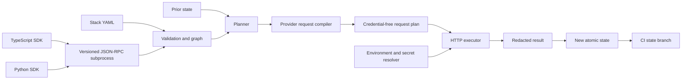

# Architecture

Stackport has one engine. Rust owns every decision that changes provider or
state behavior. The CLI, Rust SDK, TypeScript SDK, and Python SDK are interfaces
to that engine.

## Core Modules

| Module | Responsibility |
| --- | --- |
| `manifest.rs` | Neutral resource model, secret checks, dependency validation |
| `stack_spec.rs` | Simple YAML model and deterministic manifest conversion |
| `planner.rs` | Create, update, delete, replace, no-op, and manual decisions |
| `providers.rs` | Declarative provider capabilities and API operations |
| `provider_runtime.rs` | Identifier chaining, request bodies, auth, HTTP, redaction, state advancement |
| `state.rs` | Versioned local state and last-applied snapshots |
| `rpc.rs` | Stable subprocess interface for non-Rust SDKs |

## Plan Semantics

1. Validation rejects unknown dependencies, dependency cycles, duplicate IDs,
   unsupported schema versions, and likely inline secrets.
2. YAML maps are converted in sorted order. The planner then topologically
   orders active resources, so dependencies run first.
3. Desired fingerprints are compared with state to select `create`, `update`,
   `delete`, `replace`, or `noop`.
4. Provider capability and lifecycle contracts can turn a step into `manual` or
   `unsupported`. Such a plan cannot be applied automatically.
5. Destroy steps use the prior resource snapshot and reverse dependency order,
   so dependents are removed before their dependencies.

## Identifier Chaining

Provider APIs usually return IDs that later resources need. Request planning
uses placeholders such as an environment ID produced by an earlier request.
The executor resolves each placeholder from the successful response immediately
before sending the dependent request. Cross-provider resources cannot satisfy
provider-scoped identifiers.

Resolved non-secret identifiers are merged into state. This supports resources
whose API returns no opaque ID, such as configuration or variable upserts.

## Failure Model

Apply is fail-fast. A failed mutation blocks later requests in that apply and
state advances only for successful requests. Read/import observations continue
after independent failures so one unavailable resource does not hide all other
results. State writes use a temporary file followed by rename.

Local state has no distributed lock, so do not run two local applies against
the same file. The GitHub Actions backend serializes applies per repository and
uses fast-forward Git pushes to reject stale state writes. It is intentionally
simple rather than a general remote locking service.
